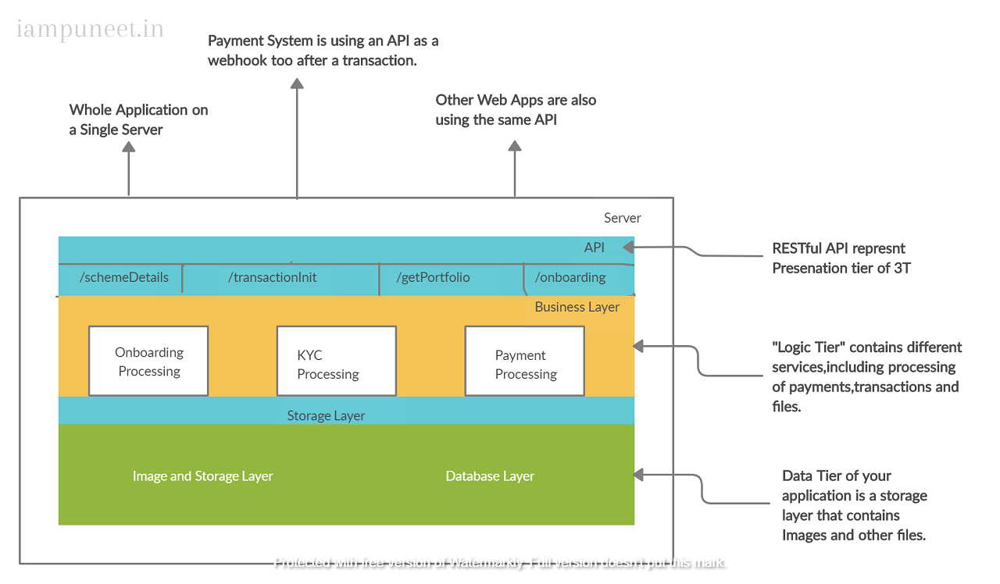
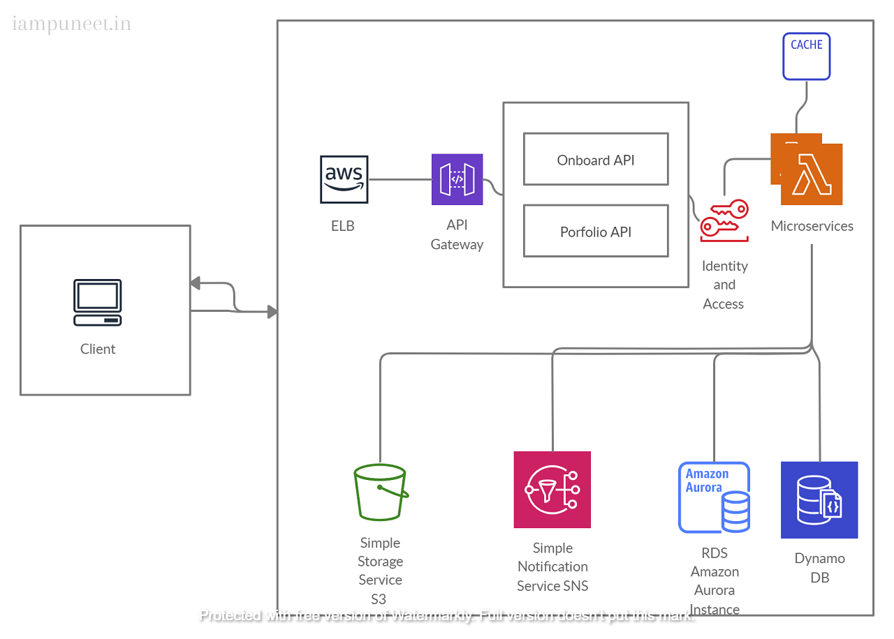

# Digital Tranformation Case Study of Bajaj Capital

A comprehensive system design analysis of microservices architecture at Bajaj Capital Ltd to power its Financial Services in India.

## Introduction  :
Bajaj Capital is a leading financial services group in India, offering services for mutual fund and bond investments, fixed-term deposits, insurance protection, and real-estate transactions. Launched in 1964, the group manages more than 1.5 million clients and assets worth more than INR 21,000 Crores [US$2.8 billion], and more than 60 percent of its clients have been with the group for over five years.

**_Technical teams have designed such an amazing system with very high availability and scalability in order to serve their customers globally_**

BCL had chosen AWS cloud to migrate its IT infrastructure because AWS could offer highly reliable databases, large-scale cloud storage and multiple data centers around the globe. By utilizing the cloud infrastructure built and maintained by AWS

BCL is also one of the first major drivers behind microservices architecture. Microservices targets the problems of monolith software design by encouraging _separation of concerns_ in which big programs are broken into smaller software components by modularity with data encapsulation on its own. Microservices also helps to increase the scalability via horizontal scaling and workload partitioning. By adopting microservices, engineers easily change any services which lead to faster deployments.

In this study, I am interested in understanding Bajaj Capital cloud architecture and its performance under different workloads and network limitations.

## Challenge Background:

Bajaj capital has a strong network of business in all over India.For more than five decades,Bajaj capital has been managing their business which was the place where many generations of people from the neighborhood spent time with their families, laughed together.

Because of the digitalization many of the customers now prefer buying mutual funds online via mobiles and website rather than filling physical forms.

Bajaj capital has network of multiple branches in all over india.So Mazor of the business comes through B2B channel.So they decided to tranform their existing system to scale that application to serve more customers all over India.Bajaj capital already has a website , but it needs a back-end application to process and store information on Customer,funds and orders.

## Solution - 1
So they begin their Transformation Journey with three tier application.This solution uses ASP.net as a server-side language and setup a database in the same database(most likely MYSQL).

A Typical Solution would have its code structured in a few layers resembling a three-tier architecture, meaning that the code is split into presentational,business, and data tiers or layers.

> THREE-TIER ARCHITECTURE Three-tier architecture is a client/server
> software architecture pattern in which the user interface
> (presentation),  functional process logic ("business rules"), and
> computer data storage and data access are developed and maintained as
> independent modules, most often on separate platforms.

To learn more about three-tier architecture, visit https://en.wikipedia.org/wiki/Multitier_architecture#Three-tier_architecture.

This approach fits perfectly for any given small application. It would work fine for Bajaj Capital for having n number of branches, at least until purchase orders grow to a certain level. Then you would need to scale your infrastructure

But to be able to scale a monolithic application, it’s necessary to detach the data layer (because you don’t want to replicate your database, for the sake of data consistency).

After that, your application would look like the one shown in figure 1.3. 

But you’d still have one conglomerate of an application with all its API routes and the business logic for everything. 
Your application could be replicated if you had too many users, but each instance would have all its services replicated as well, regardless of their usage.

### Serverless Approach : 

Creating serverless applications requires a different approach, as these applications are event-driven and fully distributed.
Instead of having one server with the API endpoints and your business logic, each part of your application is isolated to independent and autoscalable containers.

In a serverless application, your requests are processed with an API router layer that has only one job: 
it accepts HTTP requests and routes them to the underlying business layer services.

The API router in a serverless architecture is always independently managed. That means that application developers don’t maintain the API router, and it’s scaled automatically by the serverless provider to accept all the HTTP requests your API is receiving. Also, you pay only for the requests that are processed.

In Bajaj Capital Tranformation instead of having one monolithic application,the business logic of a serverless application is often split into smaller units.The size of each unit depends on your preferences.

Most of the time, its size does not directly affect the infrastructure cost, because you are paying for function execution
Units are also scaled automatically, and you won’t pay for units that aren’t processing anything, so owning one or a dozen of them costs the same.

**For Bajaj Capital, a sensible solution is to have one unit for processing BSE Transactions, one for onboarding, one for handling portfolio, and so on.In total Bajaj Capital Serverless Architecture contains round about 17 Repositries.**

The last part of your architecture is the data layer, which can be similar to the data layer in a scaled monolithic application, with a separately scaled database and file storage service
Database and file storage were also independent and autoscalable.

### Serverless Architecture using AWS Services

Backend Infrastructure includes services databases, storages running entirely on AWS cloud.Some of the components of Backend with their corresponding AWS services are listed as follows:

 1. API Gateway
 2. Scalable computing instances (AWS EC2)
 3. Scalable storage (AWS S3)
 4. Business logic microservices
 5. Scalable distributed databases (AWS DynamoDB, AWS Aurora)

**API Gateway Service** : API Gateway Service communicates with AWS Load Balancers to resolve all requests from Clients.This component can be deployed to multiple EC2 instances across  to increase availbility.

Application API : Application API plays an important role of an orchestration layer.These APIs provides a logic of composing call to underlying microservices in the order needed.Considering the Onion Architecture,Application APIs component contains core business functionalities.

It also need to be scalable, highly available under high request volume.Application API are defined mazorly in different Categories : 
 - Onboarding API
 - Portfolio API
 - Transaction API
 - Razorpay Payment API
 - MF_schemes API

**Microserices :** A microservice can work on its own or call other microservices via REST.The implementation of microservice can be similar to that of Application API in which the requests would be put into the Network Event Loop and results from other called microservices are placed into the result queue in asynchronous non-blocking I/O.
Each microservice can have its own datastore and some in-memory cache stores of recent results.

**Data Stores :** When migrating their infrastructure to AWS cloud,we made use of different data stores both SQL and NoSQL, for different purposes MySQL databases are used for movie title management and transactional/billing purposes.ElasticSearch has powered searching Fund Searching.

DynamoDB is a distributed column-based NoSQL data store to handle large amounts of read requests with no single point of failure. To optimize the latency over large write requests, DynamoDB is used because of its eventually consistent ability.

