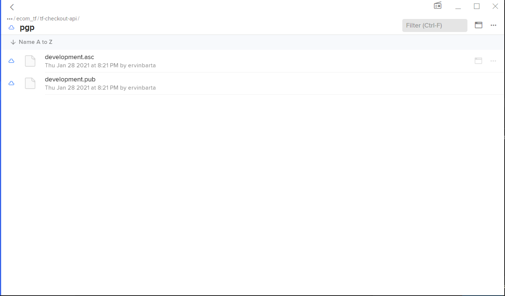

# Secure secrets of Environment with Mozilla SOPS and Keybase

## Problem Definition  :
Security concerns raises when we have multiple teams working on single project and those .env files which consist your most precious environemnt variables which can be username / password , API key & secrets for third party external libraries.

## Solution by SOPS  :
You can use SOPS to store encrypted secrets in Git, using AWS/GCP KMS to encrypt/decrypt them (or encrypt/decrypt the encryption key) and have infrastructure automation that gets the secrets from sops and exposes them to applications as environemnt variables

The best part of the SOPS is that it understand structured files e.g. JSON, YAML and encrypt only values , leaving the keys intact to easily inspect.


Example - This local-secrets.env checked into github along with the code and else this can be easily distributed within teams as well
```js
STRIPE_USERNAME = 'admin'
STRIPE_PASSWORD = '4321@admin@adeyan'
```

Steps for Installation : 

I prefer to use WSL for local development for that you need to install go first and that you can install with follwoing steps

1. **Install Go**

```js
cd ~
curl -O https://dl.google.com/go/go1.10.3.linux-amd64.tar.gz
```

```
sha256sum go1.10.3.linux-amd64.tar.gz
```
Then you get that output with the some hashed value.

Next you can `tar` to extract the tarball. The x flag tells tar to extract , `v` tells it we want verbose output and  `f` tells it we'll specify a filename:

```js
tar xvf go1.10.3.linux-amd64.tar.gz
```

2. **Install SOPS**

```
$ go get -u go.mozilla.org/sops/v3/cmd/sops
$ cd $GOPATH/src/go.mozilla.org/sops/
$ git checkout develop
$ make install
```
3. **Install Keybase** 
   
   https://keybase.io/docs/the_app/install_linux

4. Encryption Key 
Now first thing you need to choose the encryption key which will be used to encrypt your secrets.

For encryption key, we can store have multiple option like AWS KMS, PGP via Keybase.

I prefereed to use PGP via Keybase. You can see in the following screenshot I have a team tf-checkout-api where I have saved some encryption key which I am going to use it for encryption.



1) **Extract encryption key from keybase**

```
keybase fs read /keybase/team/ecom_tf/tf-checkout-api/pgp/development.asc
```


5) Import pgg Key via gpg

```
gpg import <(keybase fs read /keybase/team/ecom_tf/tf-checkout-api/pgp/development.asc)
```

6) You can define your creation rules in .sops.yaml like

```js
creation_rules: 
   - path_regex: \.dev\.(dev|enc)\.yaml$
   pgp: xxxxxxxxxxxxxxxxxxxxxxxxxxxxxxxx
```

Also you can create a secrets.dev.dec.yaml file : 
```
example_key: mysamplesecret
```
7) This is the final step after importing gpg key you can actually encrypt/decrypt your keys. You can add this into your npm script.

```js
encrypt:secrets:dev: "sops -e secrets.dev.dec.yaml > secrets.dev.enc.yaml"
decrypt:secrets:dev: "sops -d secrets.dev.enc.yaml > secrets.dev.dec.yaml"
```

8) After running decryption script you can check `secrets.dev.enc.yaml` where all of your secrets are placed in encrypted form.

Now you need to all the keys in .env file that you have defined in your `secrets.dev.dec.yaml`

Here is the module for that :https://www.npmjs.com/package/env-yaml

```js
require('env-yaml').config({ path: '/custom/path/to/your/yaml/env/vars' });
```

That's it !