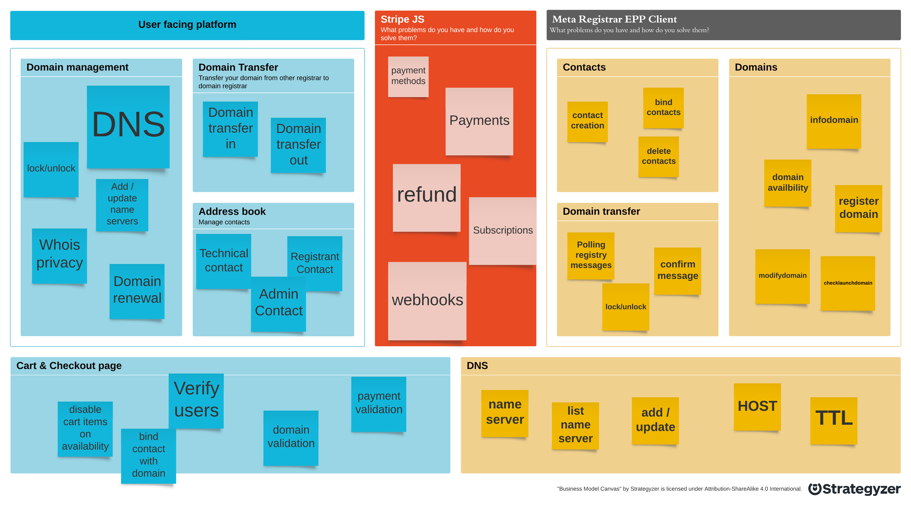
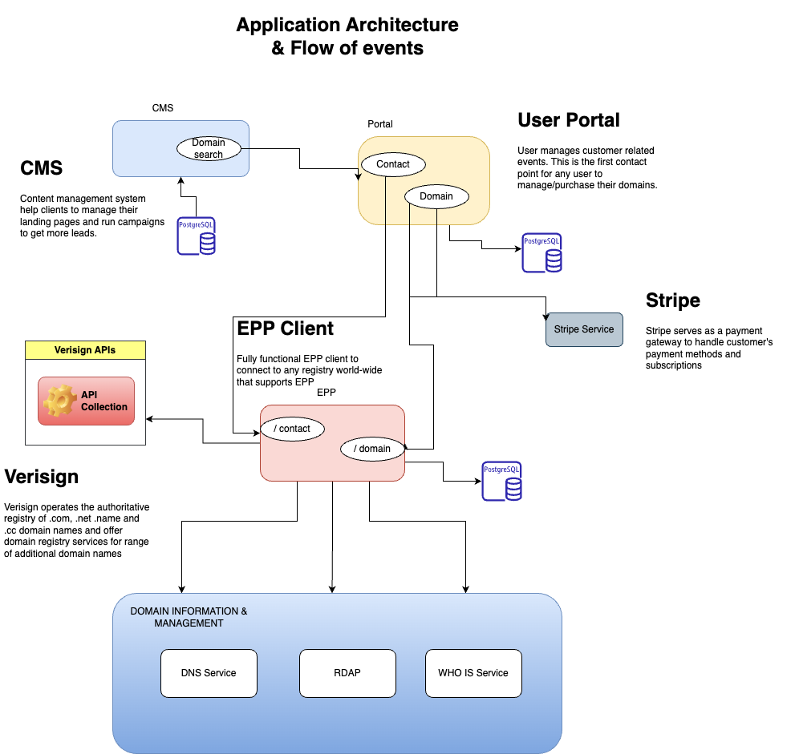
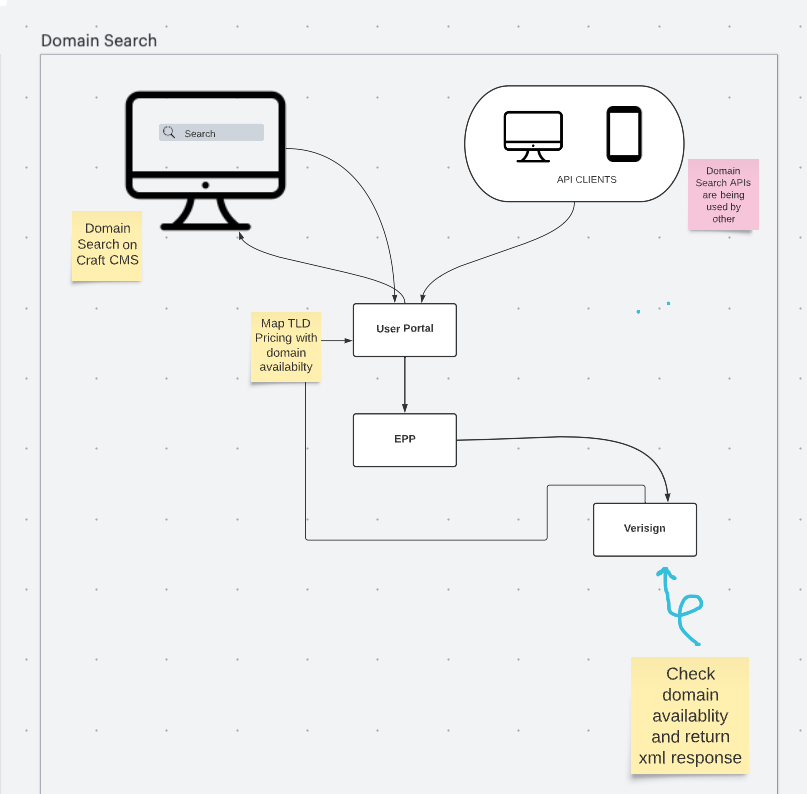

# Understanding the System Design for Domain Registration MVP

## Overview  :
Let's  check  out  the system design  for  domain registration!  It's a big  deal  for any person or business  to  get  an  online  presence, so  the  process  for  registering  a domain name is  essential.  We'll  be  looking  at  how domain availability, validation  and DNS management  works, plus  how  to  keep  the  registration renewed. Plus,  we'll  check  out the architecture and what  tech stack is  good  for  building  and  maintaining  the  system. Domain  registration is key to the internet, so  let's get into the details to  make  sure  the  system is  both efficient  and user-friendly.


## Parts of the Domain Registration process :

In this article we'll be talking about some modules in Domain registration 

 - Domain Search & Pricing mapping with TLD
 - Checkout & Domain Subscription Process
 - Domain Transfer process
 - Whois service & RDAP
 - How We keep separation of concern while integrating EPP, Stripe, DNS & WHOIS services in NUXT to keep scalability in mind.
 - Next level design of a Domain Registry Application


Following are the modules available in one domain registrar design system : 




 **Tech Stack**

When it comes to building a domain registration system, selecting the right tech stack is essential for creating a robust, efficient, and scalable solution. The tech stack should include technologies that support essential functionalities such as domain availability, validation, DNS management, and renewal.

One of the core components of the tech stack is the programming language. Languages like Java, and Node.js are popular choices for building domain registration systems. Along with the language, the tech stack should include a suitable framework like Spring or Express.js, depending on the language choice.

Database management systems like PostgreSQL, MySQL or MongoDB,  are essential for storing and managing domain registration data. For ensuring fast and efficient processing, technologies like Redis and Memcached can be used for caching frequently accessed data.

To ensure the security of the system, technologies like SSL certificates, firewalls, and intrusion detection systems should be implemented. Additionally, integrating third-party services like payment gateways, email services, and domain registrars can further enhance the functionality and user experience of the system.

Ultimately, the tech stack for a domain registration system should be carefully chosen to support essential functionalities, ensure scalability and performance, and provide a secure and reliable experience to the users.


**User Interface Portal Tech stack :** 

 - Nuxt framework
 - Postgresql
 - AWS Serverless
 - Nodejs Express
 - Sequelize
 - Docker
 - AWS ECS

**Meta Registrar EPP :** 
 - Postgresql
 - PHP
 - Docker

**Content Management of landing pages :** 
 - Craft CMS
 - Native Javascript 


**Application Architecture or Flow of events  **



The flow of events in a domain registration system typically begins when a user enters a domain name that they wish to register. The system checks the domain availability and displays the result to the user. If the domain is available, the user can proceed with the registration process.

The next step is to collect the user's information, including their name, contact information, and payment details. The user can select the duration of the registration, and the system calculates the total cost of registration. Once the user verifies the details and agrees to the terms and conditions, the payment is processed, and the domain registration is completed.

Once the domain is registered, the system updates the DNS records to ensure that the domain resolves to the correct IP address. The user can then access their domain's control panel, where they can manage the DNS settings, renew the registration, and view other domain-related information.

In addition to the registration process, the system should also handle domain transfers, renewals, and cancellations. The system should send reminders to the user when the registration is due to expire and provide an easy option to renew the registration.

Overall, the flow of events in a domain registration system should be simple, intuitive, and user-friendly, providing a seamless experience to the user while ensuring the security and reliability of the system.


**Domain Search & Pricing mapping with TLD**

In Domain search process, Initially the request will go from User Portal (Nuxt) to Meta Registrar Epp Application and this will require to have login connection with meta registrar so it need an interface to authorize EPP Application with username and password. 





You check a domain by sending a check->domain:check command. You can supply the domain-names in their utf-8 format.In this example we are checking icanhascheeseburger.frl and the icanhascheeseburger.eu domain for availability.

```
    #### Example domain:check
    <?xml version="1.0" encoding="UTF-8"?> 
	    <epp xmlns="urn:ietf:params:xml:ns:epp-1.0" xmlns:domain="urn:ietf:params:xml:ns:domain-		1.0"> 
		    <command> 
			    <check> 
				    <domain:check> 
					    <domain:name>docu-test-case.nl</domain:name> 
					</domain:check>
				</check> 
			     <clTRID>57cff5b3750b3</clTRID> 
		     </command> 
	     </epp>


    #### Example domain:check response
    
    <?xml version="1.0" encoding="UTF-8"?>
    <epp
    	xmlns="urn:ietf:params:xml:ns:epp-1.0"
    	xmlns:domain="urn:ietf:params:xml:ns:domain-1.0">
    	<response>
    		<result code="1000">
    			<msg>Command completed successfully</msg>
    		</result>
    		<resData>
    			<domain:chkData>
    				<domain:cd>
    					<domain:name avail="true">docu-test-case.nl</domain:name>
    				</domain:cd>
    			</domain:chkData>
    		</resData>
    		<trID>
    			<svTRID>MTR_ffbe414d2285cc8a2c5b8fabd98f491be9552743</svTRID>
    			<clTRID>57cff5b3750b3</clTRID>
    		</trID>
    	</response>
    </epp>
```

Ref : https://www.metaregistrar.com/docs/examples/domains/domain-check.html

The above result (`avail:true`) indicates that the domain name is not registered and thus available for registration. You can proceed with registering the domain name.

If an `avail:false` result is returned, the extra info `domain:reason` will tell you why the domain name is not available for registration. That might be because the domain name is already registered. 

To validate this, you can parse the in an EPP mappers / helpers and the return the response to the User Portal or to the CMS.

**Conclusion **

In this article, we've explored the flow of events and architecture of domain registraion. We've looked at the different modules/services included in the whole process and how TLD pricing tied to domains.

We've also discussed the importance of selecting the right tech stack for building a robust and efficient domain registration system. From the programming language and framework to the database management system and security technologies, every component of the tech stack plays a vital role in creating a reliable and user-friendly system.

In the next part of this series, we'll dive deeper into the architecture of a .

Stay tuned for the next part, where we'll continue our exploration of the domain registration system design and elobrate more on checkout process.


